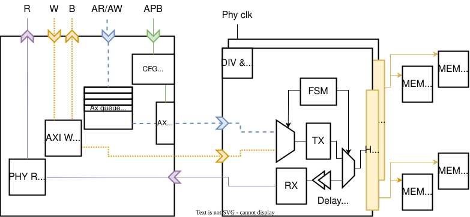

# Specification

This page describes the architecture, interface, and implementation details of the HyperBus Controller IP.

---

---

## Block Diagram

*Figure 1 — Top-level block diagram of the controller.*

The controller sits between the on-chip AXI4 interconnect (host side) and the off-chip HyperBus
devices (memory side). A Regbus register interface provides runtime configuration.

---

## Functional Description

### Purpose

This IP provides a fully synthesizable RTL implementation of a HyperBus Controller, enabling
seamless communication between an on-chip system and off-chip HyperBus devices such as HyperRAM
(PSRAM) and HyperFlash (NOR Flash).

It abstracts the complexity of the HyperBus protocol and exposes a standard **AXI4 slave
interface** to the host system controller.

### Usage Context

HyperBus is primarily used to connect high-bandwidth, low-pin-count external memories:

- **HyperRAM (PSRAM)** — used as framebuffer, scratchpad, or general data memory
- **HyperFlash (NOR Flash)** — used for XIP (eXecute-In-Place) code execution

The controller can also interface with generic peripherals that implement the HyperBus electrical
and timing specifications.

Typical applications include:

- MCU/SoC memory expansion
- Low-latency XIP code execution from HyperFlash
- Framebuffer or scratchpad memory using HyperRAM
- FPGA-based embedded systems requiring compact, high-speed external memory

### Supported Standards and Protocols

This peripheral implements:

- **AXI4** slave interface — read/write channels, bursts, protection attributes
- **HyperBus protocol** as defined in the Cypress/Infineon HyperBus Specification v1.x
  ([publicly available](https://www.cypress.com/file/213356/download))
- Standard HyperBus signaling for both device types:
    - `CK` / `CK#` — differential clock
    - `RWDS` — read/write data strobe (latency signaling + write strobe)
    - `CS#` — chip select (one per device)
    - `DQ[7:0]` — bidirectional data bus

---

## Interface

### AXI4 Slave (Host Side)

The controller exposes a single AXI4 slave port. Key properties:

| Signal group | Description |
|---|---|
| Write address channel (AW) | Address, burst length, burst type, protection |
| Write data channel (W) | Data, strobe, last |
| Write response channel (B) | Response code (OKAY / SLVERR) |
| Read address channel (AR) | Address, burst length, burst type, protection |
| Read data channel (R) | Data, response code, last |

**Constraints on AXI transactions:**

- Only **INCR** (incrementing) bursts are supported. WRAP and FIXED bursts are not.
- Atomics (`ARLOCK`/`AWLOCK` exclusive accesses) are **not** supported.
- All accesses except byte-size must be **aligned to 16-bit (2-byte) boundaries**.
- Burst lengths follow standard AXI4 rules; the controller splits bursts as needed.

### HyperBus PHY (Device Side)

| Signal | Direction | Description |
|---|---|---|
| `CK` | Output | HyperBus differential clock (positive) |
| `CK#` | Output | HyperBus differential clock (negative) |
| `CS#[N-1:0]` | Output | Chip select, one per device (active low) |
| `RWDS` | Bidir | Read/write data strobe — output during writes, input during reads |
| `DQ[7:0]` | Bidir | Bidirectional data bus |

### Regbus Configuration Interface

Runtime configuration is exposed via a minimal **Regbus** register interface (address-mapped,
synchronous). Data and address widths are parameterizable; register sizes must be a power of two
larger than 16 bits.

---

## Register Map

The register set provides runtime control over all protocol timing and device parameters.

### Register Groups

| Group | Description |
|---|---|
| **Timing** | `tACC`, `tRC`, `tCSHI`, and other HyperBus timing parameters |
| **Burst** | Burst configuration, clock-stop enable, burst-split thresholds |
| **Latency** | Latency mode selection (fixed / variable), initial latency count |
| **Refresh** | HyperRAM auto-refresh optimization parameters |
| **Status** | Read-only: state machine status, error flags, device behavior |
| **Power** | Clock gating, HyperRAM low-power mode (Hybrid Sleep / Deep Power-Down) |
| **Multi-chip** | CS# assignment and per-device configuration |

    <!-- TODO: embed or link generated register table here -->

---

## Features and Requirements

### Supported Operations

| Operation | HyperRAM | HyperFlash |
|---|---|---|
| Single read | ✅ | ✅ (WIP) |
| Burst read | ✅ | ✅ (WIP) |
| Single write | ✅ | ✅ (WIP) |
| Burst write | ✅ | ✅ (WIP) |
| Register read/write | ✅ | ✅ (WIP) |
| XIP read pipeline | — | ✅ (WIP) |

### Architectural Features

**Command and transaction management**

- Automatic generation of HyperBus Command/Address (CA) packets
- Burst assembly and splitting based on AXI burst structure and device constraints
- Support for both memory types:
    - HyperRAM: variable-latency reads, fixed-latency writes
    - HyperFlash: command sequences, linear reads, programming operations *(WIP)*

**Timing control**

- `CK`/`CK#` differential clock generation
- `RWDS` monitoring for read latency determination and data strobe alignment
- Turnaround, idle cycles, and write-to-read / read-to-write transitions
- PHY-level clock stopping for burst stalling
- Optional internal timing calibration (if enabled in the integration)

**AXI interface**

- AXI4-compliant read and write slave paths
- Burst length translation, alignment correction, and response generation
- Back-pressure and outstanding transaction control
- Independent read and write paths

### Known Limitations

!!! warning "Restrictions"
    - **Atomics** are not supported.
    - Only **linear (INCR)** AXI bursts are supported.
    - All non-byte accesses must be aligned to **16-bit boundaries**.
    - **HyperFlash** support is work in progress — only HyperRAM has been fully tested.
    - Clock-stop **must** be supported by the target device; there is no burst buffering to
      accommodate devices without clock-stop capability.

### Open TODOs

- [ ] Support byte-aligned accesses for non-byte-size transfers
- [ ] Complete and validate HyperFlash support
- [ ] Add PSRAM support via an additional CA decoder

---

## Timing Diagrams

!!! info "Work in progress"
    Timing diagrams for key transactions (single read, burst write, latency extension, clock stop)
    will be added here. In the meantime, refer to the
    [HyperBus Specification](https://www.cypress.com/file/213356/download) for protocol-level
    timing.

<!-- TODO: add timing diagrams for:
  - Single-word read (fixed latency)
  - Single-word read (variable latency + RWDS extension)
  - Burst write
  - Clock-stop mid-burst
  - Write-to-read turnaround
-->

---

## Implementation details

### Module Breakdown

The RTL is organized under `src/`. Top-level module: `axi_hyper`.

| Module | File | Description |
|---|---|---|
| `axi_hyper` | `src/axi_hyper.sv` | Top-level: AXI slave + Regbus config + PHY |
| *(AXI adapter)* | `src/` | Translates AXI4 transactions to internal command stream |
| *(Transaction FSM)* | `src/` | Builds HyperBus CA packets, manages burst splitting |
| *(PHY / clock gen)* | `src/` | CK/CK# generation, DQ/RWDS IOB interface |
| *(Register file)* | `hw/regs/` | Auto-generated by regtool from register description |

!!! note
    Module names and file paths should be verified against the repository.
    <!-- TODO: fill in exact module names from src/ -->

### Parameters and Configurations

Top-level parameters of `axi_hyper`:

| Parameter | Type | Description |
|---|---|---|
| `AxiAddrWidth` | int | AXI address width (bits) |
| `AxiDataWidth` | int | AXI data width (bits) |
| `AxiIdWidth` | int | AXI ID width (bits) |
| `AxiUserWidth` | int | AXI user signal width (bits) |
| `RegAddrWidth` | int | Regbus address width |
| `RegDataWidth` | int | Regbus data width (must be power-of-two ≥ 16) |
| `NumChips` | int | Number of HyperBus CS# lines (devices) |
| `IsClockODelayed` | bit | Enable output-delay-based clock phase adjustment |

!!! note
    <!-- TODO: verify and complete parameter list from axi_hyper.sv -->

### Reset Behavior

The controller uses an **active-low synchronous reset** (`rst_ni`). On de-assertion:

- All FSMs return to idle state.
- AXI channels drain any in-flight transactions gracefully (no AXI protocol violation).
- Register file resets to default values (see register map for reset values).
- PHY outputs: `CK`/`CK#` stops toggling, `CS#` deasserted (high), `DQ`/`RWDS` tristated.

!!! note
    <!-- TODO: verify reset polarity and synchronous/asynchronous from RTL -->

### Clock Structure

| Clock domain | Signal | Source | Description |
|---|---|---|---|
| System clock | `clk_i` | SoC clock tree | Clocks AXI interface and control logic |
| HyperBus clock | `clk_phy_i` | Separate PHY clock or divided `clk_i` | Drives CK/CK# generation |

!!! note
    <!-- TODO: verify clock domain names and CDC strategy from RTL -->

The differential HyperBus clock (`CK`/`CK#`) is derived from `clk_phy_i` and gated during
idle periods and clock-stop events.

### Power Domains

The IP is designed for a **single power domain**. Power management features include:

- **Clock gating** — `CK`/`CK#` halted during idle or stall
- **HyperRAM low-power modes** — Hybrid Sleep and Deep Power-Down, controlled via register map
- No multi-voltage domain crossings inside the IP

